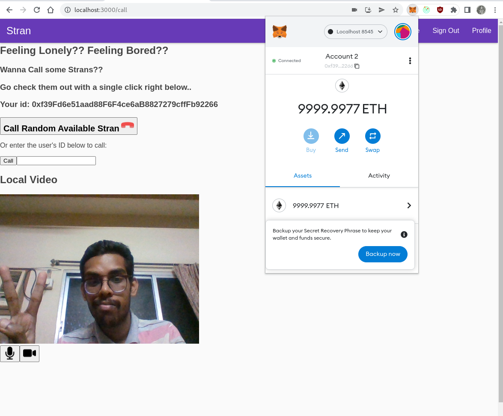
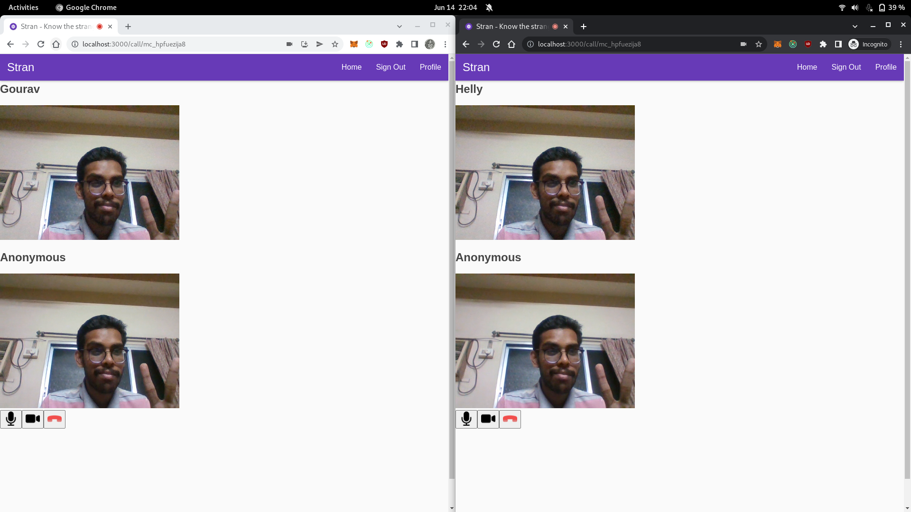
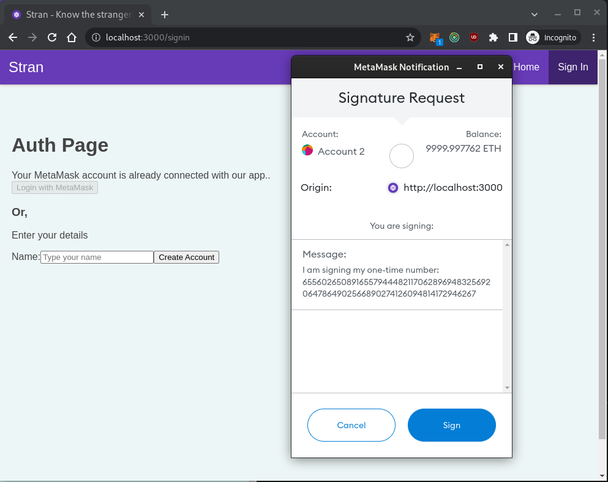

# Stran - A Video Calling P2P Dapp

> **Know the unknowns, whilst being *private***

This is a video calling peer-to-peer decentralised app, centered to the users to connect with unknowns, whilst also being on the **3rd era of Web, i.e. the modern and more privacy-focused web**.

## Fancy Pics of this CoOl Project

The below pics are updated as on 14th June, 2022. They might not be the latest.

### Video Calling Main Page



### Ongoing Call Screen



### One Step Login through MetaMask



## Project Installation

> This project currently does not use custom docker setup.

**Note: Currently, I have not tested docker setup fully. Yet, I am keeping the docker files in place, as we would need that for sure in future.**

### Prerequisites

- NodeJS version required is `v16.8.0`, bcoz node17 and above have breaking changes for the blockchain and hardhat framework.
- If we will be using ipfs services, then we have to install **go-ipfs** on your host system.

### Installation/Setup Guide 🤔

> Firstly, *clone this repository*.

1. Install all the npm packages required for smart contract code, frontend and server, in one go.

    ```sh
    npm run full-install
    ```

2. Install go-ipfs in the host system and then initialize the installed ipfs.

    The below command should be run only once, in the first initialization:

    ```sh
    ipfs init
    ```

3. Configure IPFS to allow CORS requests (needed this config only once):

    ```sh
    ipfs config --json API.HTTPHeaders.Access-Control-Allow-Origin "[\"*\"]"
    ```

## Hacky Commands for *Geeks* 🤓

- Run a local redis server:

    ```sh
    # below command pulls the redis image and runs the redis container in background
    # when we will kill this container, it automatically would get removed too
    docker run --name redis -p 6379:6379 -d --rm redis

    # To enter into the redis container, run below commands
    docker exec -it redis /bin/bash
    # and then run below command inside that docker container, to have redis cli
    redis-cli
    ```

- Run a local ipfs node (it runs a daemon):

    ```sh
    ipfs daemon --enable-pubsub-experiment
    ```

- Compile the smart contracts:

    ```sh
    npm run sc:compile
    ```

- Run tests on smart contracts:

    ```sh
    npm run sc:test
    ```

- Run Hardhat Network, such that external clients can connect to it:

    ```sh
    npm run sc:localnode
    ```

- Connect ***MetaMask*** to Local node:

    - After running the local node, connect the MetaMask to that local node.
    - Then goto the metamask profile settings and to Advanced, then enable "Show Test Networks".
    - Then, click on the circle icon of yours, and then click "Import Account", and then provide the private key of one of the accounts of that localnode.
    - *Hurray!!*, you have successfully setup your localnode in Metamask.
    - Refer [this article](https://dev.to/dabit3/the-complete-guide-to-full-stack-ethereum-development-3j13) for more details.

- Deploy the smart contract -- It will firstly compile the smart contracts and then would deploy them.

    ```sh
    npm run sc:deploy
    ```

- Build the client-side code and serve it locally:

    ```sh
    npm run app:serve
    ```

- Run a development spin for the client-side code, so that it can watch the file changes and reload:

    ```sh
    npm run app:start
    ```

- Test the frontend application:

    ```sh
    npm run app:test
    ```

## Docker Setup

### Prerequisites

- Before running docker, edit below things that should be done as per docker setup:
    - The package.json in the root folder has a config env field, just change the value like below:
        ```json
        {
            "config": {
                "env": ".env.docker"
            }
        }
        ```
- Install docker and docker-compose, and then enable the docker daemon service globally.

### Docker Commands

> Run all the below commands only in the root folder context, as `docker-compose` command checks the file passed as parameter, and the current directory too..

- Build and run the project in Production mode using following command:

    ```sh
    npm run docker-prod:build
    ```

- Only run the already-built docker image in production mode:

    ```sh
    npm run docker-prod:up
    ```

- Build and run the project in development mode using following command:

    ```sh
    npm run docker-dev:build
    ```

- Only run the already-built docker image in development mode:

    ```sh
    npm run docker-dev:up
    ```

- Run the deploy script after the `docker-compose up` commands:

    ```sh
    npm run docker:sc:deploy
    ```

- Remove the created containers:
    
    ```sh
    npm run docker:down
    ```

    > Note: Doing `Ctrl+D` will only stop the container, but will not remove them.

## Some notes for developers 🧠

### Services and their used Port numbers

| Service                    | Port Used   |
| -------------------------- | ----------- |
| IPFS WebUI                 | 5001        |
| IPFS Daemon Service        | 8080        |
| NodeJS Server              | 8081        |
| PreactJS Frontend          | 3000        |
| Local Blockchain Network   | 8545        |
| Redis Service              | 6379        |

**Note:**
- Outside docker, every service runs on localhost. 
- But inside docker, if a service let's say `backend` service of the docker-compose wants to interact with `redis-server` and `blockchain` internally, then it has to use the redis host as `redis-server` in the code for connecting.
- If we run the services using docker-compose, the ports gets exposed to the localhost, and I can easily access frontend using "http://localhost:3000", or the server backend on "http://localhost:8081" or the redis service on localhost on TCP Port 6379 (Note: redis does not have http service). Blockchain network is accessible on localhost in the metamask extension on port 8545.
- As we run the frontend from outside the docker, it should access the localhost and not the backend service that is given.

### Environment Variables

- The environment variables are mentioned in a all-in-one single local or single docker env file, for all the services.
    - We use `dotenv-cli` package in the root `package.json`, and for each script, we load the environment variables from the `.env.*` file mentioned, using this package.
    - This `dotenv-cli` loads the environment variables into that particular script, but to use those environment variables directly into a script, we have to do: `bash -c '<commands-with-args>'`
    - Note: `bash -c` is not necessary, if the environment variable is to be passed to the command like npm. Npm loads the variables by itself automatically from the environment.

- Environment variables `.env.*` files:
    - `.env.local`: This is the local environment file, which is for running the scripts on localhost, outside the docker environment.
    - `.env.docker`: This is the docker specific environment file, which is for running the scripts in the docker environment, with docker specific environment variables and values.
    - `.env.sample`: Sample file to make the respective above-mentioned env files with the similar field structures.

- To deploy the environment variables to production, we can directly add the variable names to the Heroku/Netlify/Other hosting platform.
    - **For example:-** If the process.env does not find the required variable in the `server` folder, then it will look for the environment defined in the parent folder of server, and if not there even, then it will go further upwards in the folder hierarchy.

## Credits to the Resources Used

- [Video on WebRTC, Video calling and Javascript integration](https://youtu.be/pv3UHYwgxnM)
- [Centralized Error Handling using Redux](https://www.pluralsight.com/guides/centralized-error-handing-with-react-and-redux)
- For blockchain deployment and testing inside docker container: [How To Dockerize Your Hardhat Solidity Contract On Localhost](https://codingwithmanny.medium.com/how-to-dockerize-your-hardhat-solidity-contract-on-localhost-a45424369896)
- [ExpressJS OPTIONS Request](http://johnzhang.io/options-request-in-express) and [CORS errors and Preflight requests](https://www.topcoder.com/thrive/articles/cors-errors-and-how-to-solve-them)
- [CORS Middleware](https://stackabuse.com/handling-cors-with-node-js/)

